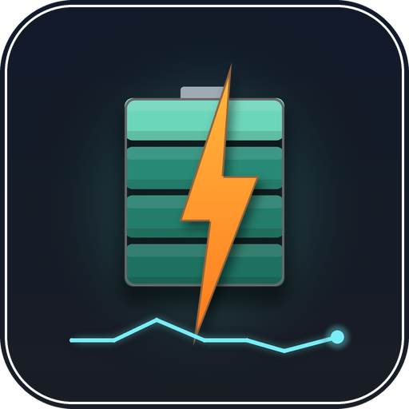

  

# Seplos HV BMS for Home Assistant

Home Assistant integration for a **Seplos HV Master Control Box (BCU-1002C)**, polled over
its proprietary RS485-1 protocol. It exposes pack, module, cell, temperature and protection-
parameter data as sensors — nothing is written back to the BMS.

## Read-only guarantee

This integration **never writes to the BCU**. It only ever sends the small, fixed set of
read-only query commands documented in `docs/SPEC.md` (identity, pack summary, status, cell
voltages, temperatures, and protection-parameter reads), each with a zero-length request
payload. There are no switches, numbers, buttons or services — nothing in this integration
can change a setting or a relay state on your battery. All charge/discharge control stays
with the BCU itself.

## Transports

The BCU speaks RS485. Home Assistant does not have an RS485 port, so you need one of:

- **Network (TCP)** — a serial-to-Ethernet gateway such as the **Waveshare
  RS232/485/422 TO POE ETH (B)**, wired to the BCU's RS485-1 port. The gateway **must** be
  configured for **transparent mode** (sometimes labelled Protocol "None") in **TCP Server**
  mode — the integration expects a raw byte pipe, not a Modbus TCP or other framed protocol.
  Default port `8899`.
- **Serial** — a local USB RS485 adapter plugged into the Home Assistant host, wired to the
  BCU's RS485-1 port. Default baud rate `57600`. This path uses
  [`pyserial-asyncio-fast`](https://pypi.org/project/pyserial-asyncio-fast/), which ships
  with Home Assistant core — the network transport works even if that package is somehow
  unavailable.

Only one client may talk to the BCU's RS485 bus at a time; the integration serialises every
request through a single lock and waits at least 30 ms between requests.

## Installation

### HACS (custom repository)

1. In HACS, open the three-dot menu → **Custom repositories**.
2. Add `https://github.com/lordblc/ha-seplos-hv` with category **Integration**.
3. Search for **Seplos HV BMS**, install, and **restart Home Assistant**.

### Manual

Copy `custom_components/seplos_hv/` into your Home Assistant `config/custom_components/`
directory and restart Home Assistant.

## Configuration

**Settings → Devices & Services → Add Integration → Seplos HV BMS**, then choose a
transport:

- **Network** — enter the gateway's host/IP and port.
- **Serial** — enter the device path (e.g. `/dev/ttyUSB0`) and baud rate.

The integration connects, reads the BMS identity (serial number, protocol and firmware
strings), and uses the BMS serial as the unique id for the config entry.

### Options

Settings → the Seplos HV BMS entry → **Configure**:

| Option | Default | Notes |
| --- | --- | --- |
| Fast poll interval | 15 s | Pack summary + status |
| Medium poll interval | 60 s | Cell voltages + temperatures |
| Slow poll interval | 3600 s | Protection parameters (trip/recover thresholds) |
| Enable individual cell voltage sensors | off | Per-cell sensors always exist but stay disabled in the entity registry until you turn this on (there can be well over 100 of them) |

Changing any option reloads the config entry.

## Entities

One device per config entry, named after the BCU's reported protocol/firmware/serial.

**Pack-level sensors**: voltage, collect voltage, load voltage (diagnostic), current, power,
state of charge, state of health (diagnostic), remaining/full/design capacity (Ah), remaining
energy (kWh), max/min cell voltage + label, cell spread, max/min temperature + label,
protocol/firmware/BMS serial (diagnostic), modules online, cells online, modules without
temperature sensors, headroom to the cell-spread alarm, headroom to the low-temperature
charge inhibit, raw relay word and status bytes (diagnostic, some disabled by default), four
raw "limit" registers (diagnostic, disabled by default, believed to be charge/discharge
limits), last cell/temperature and last protection-parameter update timestamps (diagnostic),
and one temperature sensor per onboard BCU sensor.

**Per-module sensors** (one set per module actually reported by the BMS — not hard-coded):
min/max cell voltage, spread, min/max cell label, sum voltage, cell count (diagnostic),
temperature sensor count (diagnostic), and min/max/average temperature.

**Per-cell sensors**: one voltage sensor per cell (up to 128 on a 4×32 pack). Disabled by
default; enable via the **Enable individual cell voltage sensors** option.

**Per-module temperature sensors**: one sensor per individual temperature probe reported by
each module. Disabled by default.

**Protection-parameter sensors** (diagnostic, disabled by default): trip and recover
thresholds for each of the ~20 whitelisted protection parameters (cell/pack over/under
voltage, over-current, over/under temperature, cell delta, SOC limits, …), at each of their
three protection levels, with the matching delay exposed as an attribute.

**Binary sensors**: charge/discharge/precharge/negative/heating relay state, current
limiting, BCU standby (all limit registers zero while charge and discharge relays are
closed), module temperature sensors missing, and a cell-spread warning (pack spread has
reached the L1 cell-delta-charge trip).

**Diagnostics**: a full config-entry diagnostics dump (Settings → Devices & Services → the
entry → **Download diagnostics**) — nothing is redacted, since no secrets are stored.

## Translations

English, Norwegian (Bokmål) and Simplified Chinese (zh-Hans) are included for every config/option
string and every entity name.

## License

MIT © 2026 lordblc

## Protocol notes and development

The BCU does **not** speak Modbus on RS485-1, even though Seplos publishes a Modbus document
for their per-pack BMS products. The wire protocol used here was reverse-engineered from the
vendor tool's own frame log and is documented in [docs/protocol-reference.md](docs/protocol-reference.md).
The gateway setup is in [docs/waveshare-transparent-mode.md](docs/waveshare-transparent-mode.md).

* `tools/bcu_cli.py` — bench CLI: `python3 tools/bcu_cli.py --host <gateway> --port 8899 [--params] [--json]`
* `tools/mock_bcu.py` — replay server built from captured frames, for development without hardware
* `python3 -m unittest discover -s tests` — protocol and client tests (standard library only)

Tested against BCU firmware `HVP-B1018-30443-1.04`, protocol `HV-PACE-ALL-CA-DATA-V0.22`,
with 4 × 32-cell BMU modules. Other module counts should work, since everything is sized from
what the BCU reports; other BCU firmware may differ.
